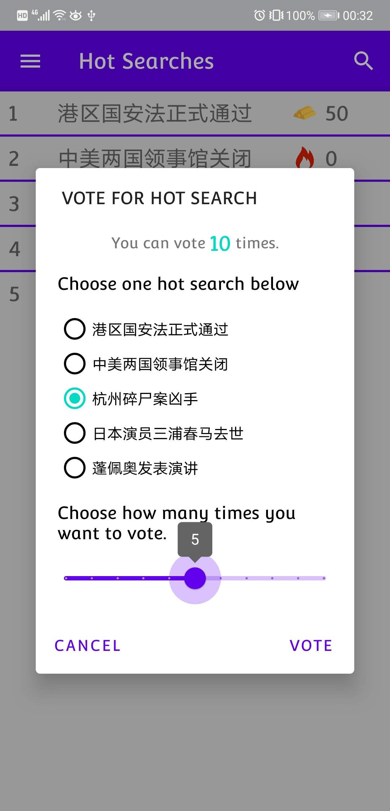

# Hot Search App For Java OO Homework!

我按照作业要求设计并实现了一个热搜排行榜系统～～

该系统为一个Android App，编程语言为Java。为了能更好地实现与用户的交互，系统采用了人性化的UI界面，而不是实例视频中的命令行交互。

如果对该系统有兴趣的话，可以在该项目的Release中下载安装本Android App进行体验。

## Screenshots

系统的功能截图在项目screenshots目录下。

### Login Page

### Home Page

### Menu

### Add && Super Add

### Vote

### Bid

# WARNING
该代码库版权归ThoughtWorks所有。
